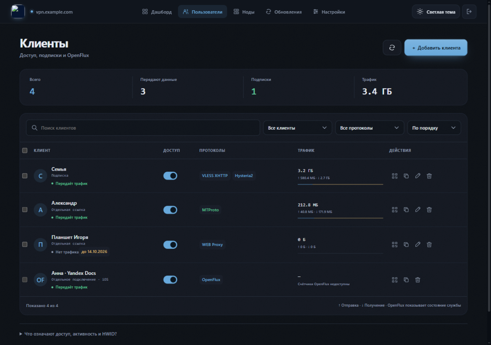
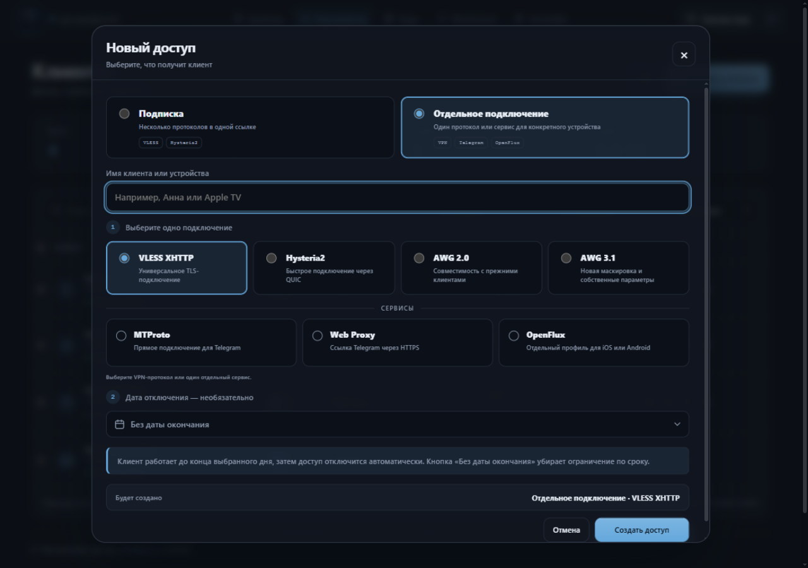
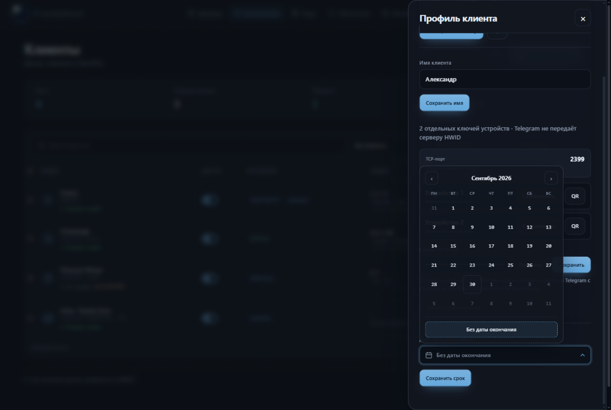
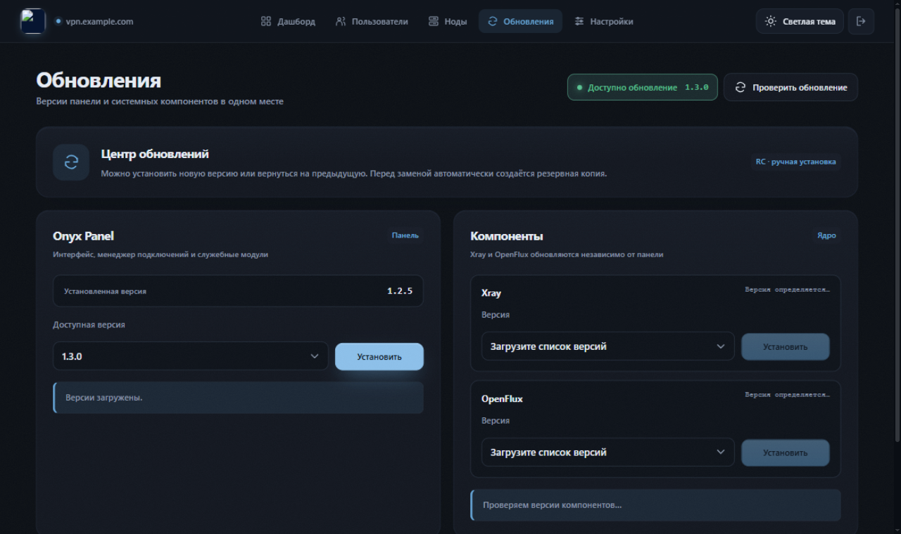
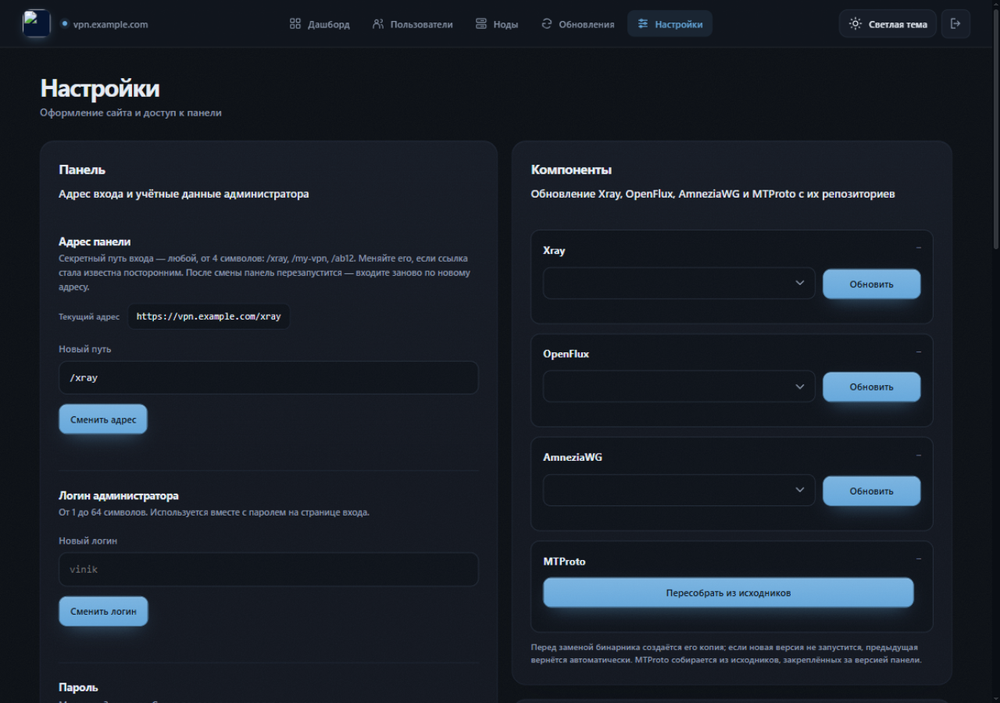
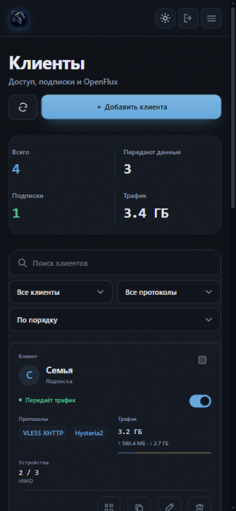

<p align="center">
  
</p>

<h1 align="center">Onyx Panel</h1>

<p align="center"><b>Панель управления VPN на своём VPS:</b> VLESS XHTTP, Hysteria2, AmneziaWG 2.0/3.1, MTProto, Telegram Web Proxy и OpenFlux — в одном интерфейсе.</p>

<p align="center">
  <a href="https://github.com/flareon2008/Onyx-Panel/releases"></a>
  <a href="LICENSE"></a>
  
</p>

---

## Установка одной командой

Подключитесь к чистому VPS по SSH и выполните:

```bash
bash <(curl -fsSL https://raw.githubusercontent.com/flareon2008/Onyx-Panel/main/install.sh)
```

Установщик сам скачает последний стабильный релиз, запросит домен, почту для сертификата и логин с паролем панели, а в конце покажет секретный адрес входа вида `https://домен/panel-…` — сохраните его.

## Что внутри

| | |
|---|---|
|  |  |
| **Дашборд** — ресурсы VPS, график трафика, состояние служб | **Клиенты** — подписки и отдельные подключения, HWID-лимиты, срок доступа |
|  |  |
| **Новый доступ** — подписка или один сервис: MTProto, Web Proxy, OpenFlux | **Дата окончания** — тематический календарь с кнопкой «Без даты окончания» |
|  |  |
| **Обновления** — панель и компоненты с резервными копиями и откатом | **Настройки** — адрес входа, учётные данные, копии в два клика |

<p align="center">
  
</p>

## Возможности

- **Подписки и отдельные подключения** — одна ссылка на все протоколы или отдельный ключ на устройство; QR-коды и готовые конфигурации.
- **VLESS XHTTP и Hysteria2** — TLS через ваш домен и быстрый QUIC.
- **AmneziaWG 2.0 / 3.1** — отдельный профиль на клиента со своими ключами, портом и маскировкой.
- **MTProto и Telegram Web Proxy** — прямое подключение и ссылка через HTTPS.
- **OpenFlux** — экспериментальный туннель через публичные документы Яндекса и Mail.ru (iOS/Android).
- **Лимиты и срок доступа** — ограничение устройств по HWID и автоматическое отключение по дате.
- **Ноды** — объединение нескольких VPS в одну подписку через Node API token.
- **HTML-заглушки** — редактор главной страницы с изолированным предпросмотром и пресетами.
- **Обновления и резервные копии** — установка и откат версий панели и компонентов одним нажатием, архив всех настроек.

## Требования

- Чистый VPS: **Ubuntu 22.04/24.04 или Debian 12**, x86_64, root.
- Домен с A-записью на сервер, свободные порты **80/tcp и 443/tcp**.
- Дополнительные порты протоколов панель покажет при создании клиентов — откройте их в firewall хостинга.

| Назначение | Порт |
|---|---:|
| HTTP и выпуск сертификата | `80/tcp` |
| HTTPS, панель, VLESS, Web Proxy | `443/tcp` |
| Hysteria2 | `8443/udp` |
| MTProto | `2399–2430/tcp` (назначается при создании) |
| AmneziaWG | `52000–52999/udp` (назначается панелью) |

Компоненты — Xray, Caddy, Go, утилиты AmneziaWG и исходники релея — скачиваются из официальных репозиториев при установке с проверкой контрольных сумм. Собранные бинарники AmneziaWG и OpenFlux идут в комплекте.

## Управление после установки

```bash
onyx-panel-update      # обновить панель до последнего релиза
ONYX                   # консольное меню: домен, логин, сертификат, удаление
onyx-panel-uninstall   # полное удаление панели
```

Все операции доступны и из веб-интерфейса. Перед каждым обновлением автоматически создаётся резервная копия; если новая версия не запустилась, прежняя возвращается сама.

## Диагностика

```bash
systemctl status onyx-panel
journalctl -u onyx-panel -n 100
ss -lntup
```

## Безопасность

- Ссылки подписок, Node API token и адрес панели — секреты. Не публикуйте их.
- Резервные копии содержат ключи доступа — храните их как пароли.
- OpenFlux передаёт только IPv4/TCP; UDP и IPv6 через него не работают.

## Лицензия

MIT. Подробности — в [LICENSE](LICENSE).
