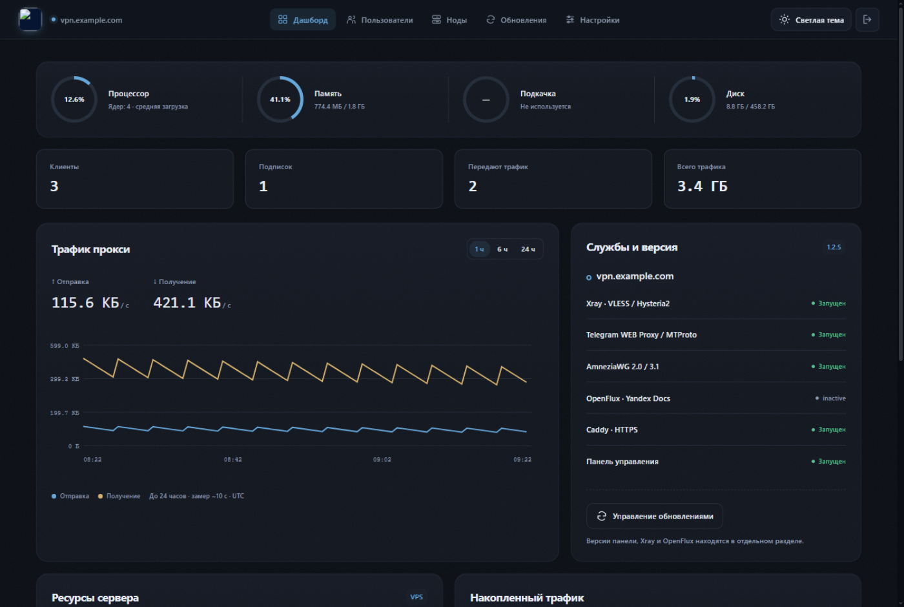

<p align="center">
  
</p>

<h1 align="center">Onyx Panel</h1>

<p align="center"><b>Панель управления VPN на своём VPS.</b><br>
VLESS XHTTP · Hysteria2 · AmneziaWG 2.0/3.1 · MTProto · Telegram Web Proxy · OpenFlux · Каскады панелей · Маршрутизация</p>

<p align="center">
  <a href="https://pay.cloudtips.ru/p/22326183"></a>
</p>

<p align="center">
  <a href="https://github.com/xCodeOn/Onyx-Panel/releases"></a>
  <a href="LICENSE"></a>
  
</p>

---

## Скриншот



## Возможности

- **Каскад панелей** — вставьте `vless://` ключ клиента верхней панели, и трафик этой панели уйдёт в интернет через неё. Режимы «Все» и «Только выбранные», проверка с показом задержки и **выходного IP**, включение/отключение одним тумблером, несколько каскадов одновременно. Поддерживаются ключи сторонних Xray-панелей (TCP, WebSocket, gRPC, XHTTP, HTTPUpgrade, HTTP/2; TLS и Reality).
- **Маршрутизация** — прямые IP-адреса и домены с пресетами стран, правила «только IPv4» и переключатель **блокировки торрентов**. Правила проверяются до каскада: совпавший трафик всегда уходит напрямую. Пресеты — это готовые geoip/geosite-списки Xray.
- **Подписки и отдельные подключения** — одна ссылка на все протоколы или отдельный ключ на устройство, QR-коды, лимит устройств по HWID, автоотключение по дате.
- **VLESS XHTTP и Hysteria2** — TLS через ваш домен (Caddy) и быстрый QUIC.
- **AmneziaWG 2.0 / 3.1** — отдельный профиль на клиента: свои ключи, порт, подсеть и параметры маскировки.
- **MTProto и Telegram Web Proxy** — прямое подключение и ссылка через HTTPS.
- **OpenFlux** — экспериментальный туннель через публичные документы Яндекса и Mail.ru (iOS/Android).
- **Ноды** — объединение нескольких VPS в одну подписку через Node API token.
- **Живой интерфейс** — статистика, статусы каскадов и правила обновляются без перезагрузки страницы; сохранения и ошибки всплывают анимированными тостами.
- **Обслуживание из шапки** — перезапуск панели и модулей (Xray, релей, MTProxy) с анимированной модалкой прогресса.
- **HTML-заглушки** — редактор главной страницы с изолированным предпросмотром и пресетами.
- **Обновления и резервные копии** — установка и откат версий панели и компонентов одним нажатием, архив всех настроек.

## Установка

Подключитесь к чистому VPS по SSH и выполните одну команду:

```bash
bash <(curl -fsSL https://raw.githubusercontent.com/xCodeOn/Onyx-Panel/main/install.sh)
```

Установщик скачает последний стабильный релиз, поставит и настроит всё сам — Caddy с сертификатом, Xray, AmneziaWG, MTProxy, релей и панель, — запросит домен, почту для сертификата и логин с паролем, а в конце покажет **секретный адрес входа** вида `https://домен/panel-…`. Сохраните его: без этого адреса панель не открывается.

### Требования

- Чистый VPS: **Ubuntu 22.04/24.04 или Debian 12**, x86_64, root.
- Домен с A-записью на сервер, свободные порты **80/tcp и 443/tcp**.
- Дополнительные порты протоколов панель покажет при создании клиентов — откройте их в firewall хостинга.

| Назначение | Порт |
|---|---:|
| HTTP и выпуск сертификата | `80/tcp` |
| HTTPS, панель, VLESS, Web Proxy | `443/tcp` |
| Hysteria2 | `8443/udp` |
| MTProto | `2399–2430/tcp` (назначается при создании) |
| AmneziaWG | `52000–52999/udp` (назначается панелью) |

Компоненты — Xray, Caddy, Go, утилиты AmneziaWG и исходники релея — скачиваются из официальных репозиториев при установке с проверкой контрольных сумм. Собранные бинарники AmneziaWG и OpenFlux, а также geo-базы Xray идут в комплекте.

## Каскад панелей

Панель может выпускать трафик через другую панель: клиенты подключаются к вашему серверу как обычно, а в интернет выходят с адреса верхней панели.

1. На верхней панели скопируйте `vless://` ключ любого клиента (раздел «Пользователи»).
2. В нижней панели откройте вкладку **Каскад → Добавить каскад** и вставьте ключ.
3. Панель сама проверит ключ живым запросом, покажет задержку и выходной IP, и включит каскад.

Дальше по желанию: режим **«Все VLESS и Hysteria2»** или **«Только выбранные»** с галочками по клиентам, несколько каскадов с приоритетом, мгновенное отключение. Понимаются и ключи сторонних Xray-панелей.

## Маршрутизация

Вкладка управляет тем, какой трафик пойдёт напрямую, минуя каскад: списки прямых IP и доменов (с пресетами стран), домены «только через IPv4» и блокировка торрентов. Формат значений — обычный синтаксис правил Xray (`geoip:`, `geosite:`, `domain:`, `regexp:`), поэтому подойдёт любой готовый список.

## Обновления и резервные копии

```bash
onyx-panel-update      # обновить панель до последнего релиза
ONYX                   # консольное меню: домен, логин, сертификат, удаление
onyx-panel-uninstall   # полное удаление панели
```

Все операции доступны и из веб-интерфейса. Перед каждым обновлением автоматически создаётся резервная копия; если новая версия не запустилась, прежняя возвращается сама. Компоненты (Xray, OpenFlux) обновляются независимо, тоже с проверкой запуска и откатом.

## Диагностика

```bash
systemctl status onyx-panel
journalctl -u onyx-panel -n 100
ss -lntup
```

## Безопасность

- Ссылки подписок, Node API token и адрес панели — секреты. Не публикуйте их.
- Резервные копии содержат ключи доступа — храните их как пароли.
- OpenFlux передаёт только IPv4/TCP; UDP и IPv6 через него не работают.

## Поддержать проект

Панель бесплатная и развивается в свободное время. Если она вам полезна — это лучшая благодарность:

<p align="center">
  <a href="https://pay.cloudtips.ru/p/22326183"></a>
</p>

## Лицензия

MIT. Подробности — в [LICENSE](LICENSE).
