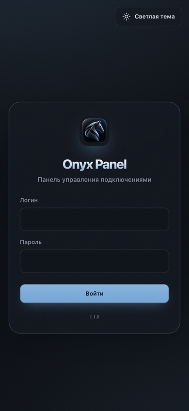

<p align="center">
  
</p>

<h1 align="center">Onyx Panel</h1>

<p align="center">Панель для собственного VPS: VLESS XHTTP, Hysteria2, AmneziaWG, MTProto и Telegram Web Proxy в одном месте.</p>

<p align="center">
  
</p>

Я собрал эту панель для себя: хочу видеть всех клиентов на одной странице, выдавать доступ на срок и не лезть в конфиги по SSH каждый раз, когда кто-то просит «ещё одно подключение». Внутри — Xray, Hysteria2, AmneziaWG 2.0/3.1, MTProto и Telegram Web Proxy. Ставится одним скриптом, работает сам.

<p align="center">
  
  
</p>

## Что умеет

Клиенты и подписки. Каждый клиент — отдельная запись со своими ключами и лимитом устройств (HWID). Подписка собирает протоколы в одну ссылку с QR-кодом. Можно выдать доступ на срок: выбираете дату в календаре при создании, панель сама отключит клиента после неё. Срок меняется потом в профиле.

Настройки без SSH. В панели меняются секретный адрес входа, логин и пароль администратора. HTML-заглушки для главной страницы редактируются прямо в браузере, со встроенным предпросмотром.

Обновления из панели. Кнопка проверки показывает свежие версии, установка идёт с резервной копией бинарника — если новая версия не запустилась, старая возвращается сама. Сама панель обновляется из этого репозитория одной кнопкой.

Резервные копии. Один архив со всеми настройками, пользователями и конфигурациями скачивается и восстанавливается из настроек. Перед импортом текущее состояние тоже сохраняется.

Автономная установка. В пакет входят Xray, Caddy, Go, AmneziaWG и исходники релея — интернет на сервере нужен только для apt-зависимостей и сертификата.

<p align="center">
  
</p>

## Установка

Нужен чистый VPS: Ubuntu 22.04/24.04 или Debian 12, x86_64, root. Домен с A-записью на сервер и свободные порты 80/443.

```bash
sudo -i
cd onyx-panel
./install.sh
```

Установщик спросит домен, почту для сертификата и логин с паролем для панели. После установки покажет адрес вида `https://домен/panel-…` — сохраните его.

Порты: 80/tcp и 443/tcp занимает Caddy, Hysteria2 слушает 8443/udp, MTProto и AmneziaWG получают свои порты при создании клиентов — их нужно открыть и в firewall хостинга.

## Обновления

Вкладка «Обновления» в панели проверяет этот репозиторий и ставит новые версии с резервной копией. Там же обновляются компоненты: Xray и OpenFlux ставятся бинарниками с их релизов, AmneziaWG собирается из исходников выбранного тега, MTProto пересобирается из источника, закреплённого за версией панели. Перед заменой бинарника панель сохраняет его копию и откатывает, если служба не поднялась.

Через SSH то же самое делает команда:

```bash
onyx-panel-update
```

Если репозиторий недоступен, обновление возьмётся из локальной копии пакета в `/opt/onyx-panel-package`.

## Консоль

```bash
ONYX
```

Меню для сервисных задач: смена домена, логина и пароля, обслуживание сертификата, удаление.

## Диагностика

```bash
systemctl status onyx-panel
journalctl -u onyx-panel -n 100
ss -lntup
```

## Замечания

- Ссылки подписок и Node API token — секреты. Не публикуйте их.
- AmneziaWG собирается из исходников тега, поэтому первое обновление занимает пару минут.
- Перед обновлением панели и компонентов создаются резервные копии, но свои бэкапы из настроек тоже стоит скачивать.
- OpenFlux — экспериментальный туннель: IPv4/TCP, без UDP и IPv6.

## Лицензия

MIT. Подробности в [LICENSE](LICENSE).
